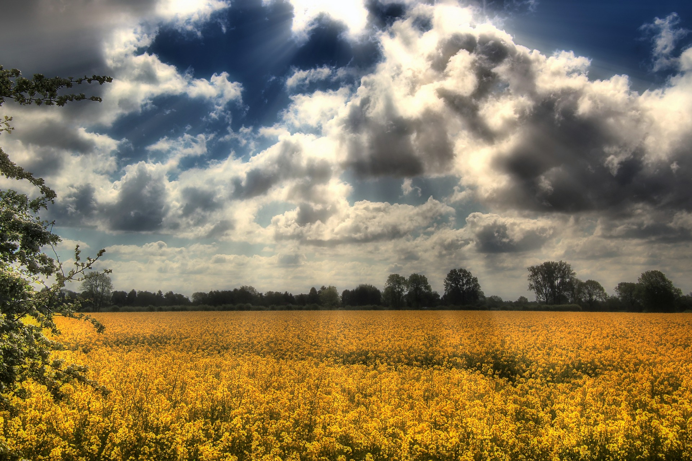

```{r echo = FALSE, message = FALSE, warning = FALSE}
library(here)
library(tidyverse)
library(knitr)
library(kableExtra)
library(readxl)
library(fs)
library(countdown)
library(xaringan)
library(xaringanExtra)
library(knitr)

hook_source <- knitr::knit_hooks$get('source')
knitr::knit_hooks$set(source = function(x, options) {
  x <- stringr::str_replace(x, "^[[:blank:]]?([^*].+?)[[:blank:]]*#<<[[:blank:]]*$", "*\\1")
  hook_source(x, options)
})

xaringanExtra::use_broadcast()
xaringanExtra::use_freezeframe()
xaringanExtra::use_scribble()
#xaringanExtra::use_slide_tone()
xaringanExtra::use_search(show_icon = TRUE, auto_search	=FALSE)
xaringanExtra::use_freezeframe()
xaringanExtra::use_clipboard()
xaringanExtra::use_tile_view()
xaringanExtra::use_panelset()
xaringanExtra::use_editable(expires = 1)
xaringanExtra::use_fit_screen()
xaringanExtra::use_extra_styles(
  hover_code_line = TRUE,         
  mute_unhighlighted_code = TRUE  
)

```

```{r xaringan-themer, include=FALSE, warning=FALSE}
library(xaringanthemer)
style_duo_accent(
  primary_color = "#F08F42",
  secondary_color = "#FFFFFF",
  inverse_header_color = "#E35F27"
)
```

---

class: center, middle

# WHY WE ARE HERE


---
# Visualisation of Impacts/Risks

.panelset[
.panel[.panel-name[Extreme Heat]
```{r echo=FALSE}
#read in images here
```

]
.panel[.panel-name[Water Body Loss]
```{r echo=FALSE}
#read in images here
```

]
]

---
# Justification behind Niger


---
# Definition of Desertification


---
# Vast potential to rectify with Great Green Wall...


---
# ...hindered by systematic challenges


---
# We bring Big Data to the rescue


---

class: center, middle

# HOW WE DO IT


---
# Methodology Framework


---
# Workflow Phase 1


---
# Workflow Phase 2


---
# Earth Observation Data


---
# Additional Data


---
# Sample Dashboard Preview
```{r echo=FALSE, out.width='100%', fig.align='center'}
knitr::include_graphics('Images/Dashboard Preview 2.png')
```
<div style="text-align: center; margin-top: 20px;">
    <p><em><strong>Source:</strong> eMapR Lab (2019)</em></p>
</div>

---
# Sample Dashboard Demo
```{r echo=FALSE, out.width='100%', fig.align='center'}
knitr::include_graphics('Images/Dashboard Dem.gif')
```
<div style="text-align: center; margin-top: 20px;">
    <p><em><strong>Source:</strong> eMapR Lab (2019)</em></p>
</div>

---
# Limitations to Our Solutions

.panelset[
.panel[.panel-name[Risk of Violence]
Farmers are reported to fear carrying out reforestation or tree maintenance activities due to the jihadist threat, which could jeopardize the project.

```{r echo=FALSE, out.width='50%', fig.align='center'}
knitr::include_graphics('Images/Nigerian-military-4.jpg')
```

<div style="text-align: center; margin-top: 20px;">
    <p><em><strong>Image Source:</strong> Reuters (2022)</em></p>
</div>
]
.panel[.panel-name[Land Conflict]
Need to introduce pastoral corridors to avoid the destruction of agriculture areas and GGW ecosystems, while ensuring access to food and water for the livestock.
```{r echo=FALSE, out.width='50%', fig.align='center'}
knitr::include_graphics('Images/herdersfarmers.png')
```

<div style="text-align: center; margin-top: 20px;">
    <p><em><strong>Image Source:</strong> Human Rights Watch (2014)</em></p>
</div>
]

.panel[.panel-name[Risk of Monoculture]

Focusing restoration effort using only few species may expose them to widespread disease setting back any progress made, while irreversibly affecting the ecosystem 
```{r echo=FALSE, out.width='50%', fig.align='center'}

```

<div style="text-align: center; margin-top: 20px;">
    <p><em><strong>Image Source:</strong> Pixabay (2017)</em></p>
</div>
]
]

---
<!-- # Recommended Action Plans -->
<!-- ```{r echo=FALSE, out.width='100%', fig.align='center'} -->
<!-- knitr::include_graphics('Images/Action Plan.png') -->
<!-- ``` -->

---

class: center, middle

# PLAN OF ACTION


---
# Project Timeline


---
# Project Costing


---
# References


---

class: center, middle

# THANK YOU

