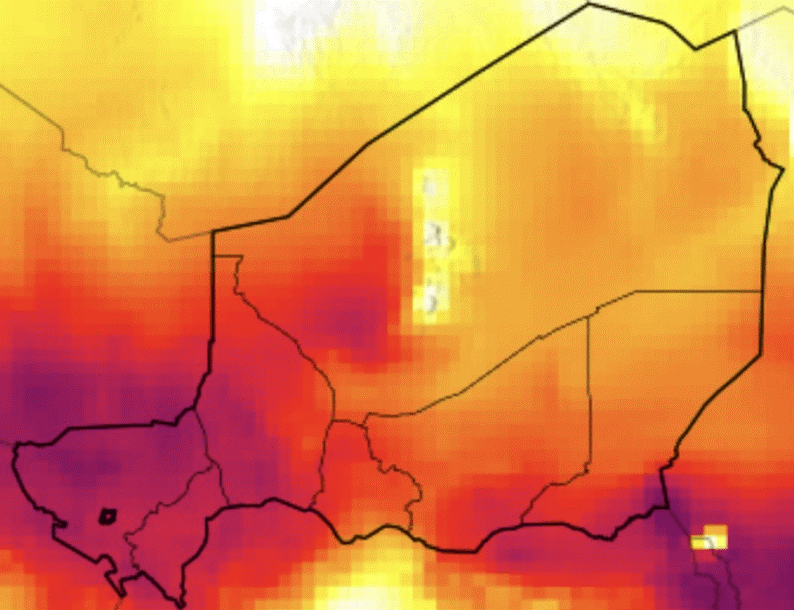
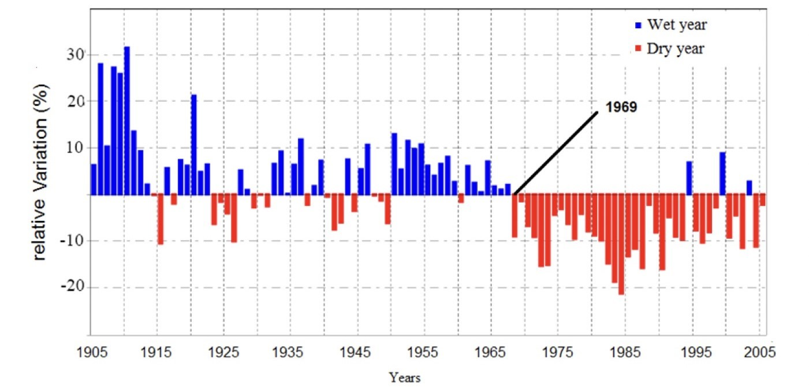

```{r echo = FALSE, message = FALSE, warning = FALSE}
library(here)
library(tidyverse)
library(knitr)
library(kableExtra)
library(readxl)
library(fs)
library(countdown)
library(xaringan)
library(xaringanExtra)
library(knitr)

hook_source <- knitr::knit_hooks$get('source')
knitr::knit_hooks$set(source = function(x, options) {
  x <- stringr::str_replace(x, "^[[:blank:]]?([^*].+?)[[:blank:]]*#<<[[:blank:]]*$", "*\\1")
  hook_source(x, options)
})

xaringanExtra::use_broadcast()
xaringanExtra::use_freezeframe()
xaringanExtra::use_scribble()
#xaringanExtra::use_slide_tone()
xaringanExtra::use_search(show_icon = TRUE, auto_search	=FALSE)
xaringanExtra::use_freezeframe()
xaringanExtra::use_clipboard()
xaringanExtra::use_tile_view()
xaringanExtra::use_panelset()
xaringanExtra::use_editable(expires = 1)
xaringanExtra::use_fit_screen()
xaringanExtra::use_extra_styles(
  hover_code_line = TRUE,         
  mute_unhighlighted_code = TRUE  
)

```

```{r xaringan-themer, include=FALSE, warning=FALSE}
library(xaringanthemer)
style_duo_accent(
  primary_color = "#F08F42",
  secondary_color = "#F08F42",
  inverse_header_color = "#FFFFFF"
)
```


class: inverse, center, title-slide, top


background-image: url('Images/112-ciencia-i-politica-.jpg') 
background-position: 50% 50%
class: center, middle, inverse

#Greening The Desert In Southern Niger


---

class: center, middle, inverse

# WHY WE ARE HERE


---
# Niger is bearing the brunt of climate change
```{r xaringan-panelset, echo=FALSE}
xaringanExtra::use_panelset()
```


.panelset.sideways[
.panel[.panel-name[Historical Heat Loss]
```{r, echo=FALSE, out.width='80%'}
knitr::include_graphics('Images/RS - images/Screenshot 2024-03-12 at 11.36.57.jpeg')
```
]

.panel[.panel-name[Projected Heat Loss]


```{r, echo=FALSE, out.width='200%',fig.align='centre'}

```


]

.panel[.panel-name[Water Bodies Shrinkage]

```{r, echo=FALSE, out.width='80%'}

```

```{r, echo=FALSE, out.width='70%'}

```

]
.panel[.panel-name[Natural Flora Loss]
```{r, echo=FALSE, out.width='70%'}
#read in images here
```

]
]

---
# Nationwide initiatives are of high-priority


---
# Vast potential with Great Green Wall...


---
# ...but hindered by systematic challenges

.pull-left[

Despite some success Senegal, Mali, and locally here in Niger, the progress of the GGW has been facing severe challenges in the last 10 years. **Poor governance at the heart of the issue:**

- **Complex Stakeholders:** Funding comes mainly from multilateral and bilateral partnerships, NGOs, and technical/financial partners. The government plays a key role but relies heavily on donor funds. 
- **Data Challenges:** Existing data is scattered, unreliable, and not well-organized. It's used by individual actors but not shared or archived effectively.

**⇒ Urgent Gap:** Maintaining and updating the unified data across diverse organisations and potentially a central web portal. 


]
.pull-right[

```{r, echo=FALSE, out.width='80%'}
knitr::include_graphics("Images/5actors.png")
```
]

---
# We bring data and expertise to the rescue


---

class: center, middle, inverse

# HOW WE DO IT


---
# Methodology Framework


---
# Workflow Phase 1


---
# Workflow Phase 2


---
# Earth Observation Data


---
# Additional Data


---
# Sample Dashboard Preview
```{r echo=FALSE, out.width='100%', fig.align='center'}

```
<div style="text-align: center; margin-top: 15px;">
    <p><em><strong>Source:</strong> eMapR Lab (2019)</em></p>
</div>

---
# Sample Dashboard Demo
```{r echo=FALSE, out.width='100%', fig.align='center'}
knitr::include_graphics('Images/Dashboard Dem.gif')
```
<div style="text-align: center; margin-top: 15px;">
    <p><em><strong>Source:</strong> eMapR Lab (2019)</em></p>
</div>

---
# Limitations and Proposed Mitigation

.panelset.sideways[
.panel[.panel-name[Insurgency Violence]
.pull-left[
Farmers are reported to fear carrying out reforestation or tree maintenance activities due to the jihadist threat, which could jeopardize the project.

**Mitigation:** Engage this data only in conjunction with local intel on insurgence activities 
]
.pull-right[
```{r echo=FALSE, out.width='100%', fig.align='center'}

```

<div style="text-align: center; margin-top: 15px;">
    <p><em><strong>Image Source:</strong> Reuters (2022)</em></p>
</div>
]
]
.panel[.panel-name[Land Conflict]
.pull-left[
Need to introduce pastoral corridors to avoid the destruction of agriculture areas and GGW ecosystems, while ensuring access to food and water for the livestock.

**Mitigation:** Confer with local herder and farmer communities to reconcile GGW planting areas
]
.pull-right[
```{r echo=FALSE, out.width='100%', fig.align='center'}
knitr::include_graphics('Images/herdersfarmers.png')
```

<div style="text-align: center; margin-top: 15px;">
    <p><em><strong>Image Source:</strong> Human Rights Watch (2014)</em></p>
</div>
]
]

.panel[.panel-name[Monoculture Risk]
.pull-left[
Focusing restoration effort using only few species may expose them to widespread disease setting back any progress made, while irreversibly affecting the ecosystem

**Mitigation:** Consult with expert botanists to diversify crop and tree species for GGW planting
]
.pull-right[
```{r echo=FALSE, out.width='100%', fig.align='center'}

```

<div style="text-align: center; margin-top: 15px;">
    <p><em><strong>Image Source:</strong> New York Times (2022)</em></p>
</div>
]
]

]

---

class: center, middle, inverse

# PLAN OF ACTION


---
# Implementation Timeline


---
# Projected Budget


---

class: center, middle, inverse

# THANK YOU


---
# References


