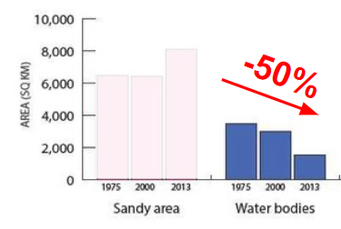
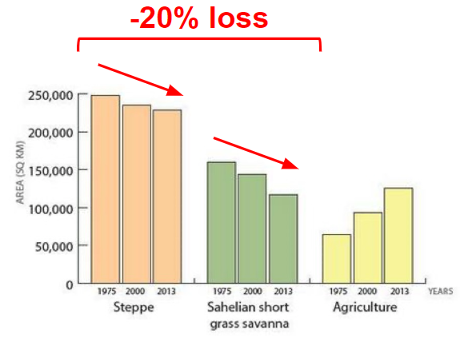
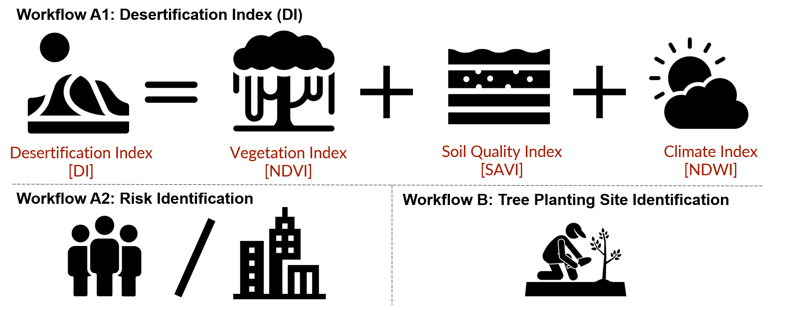
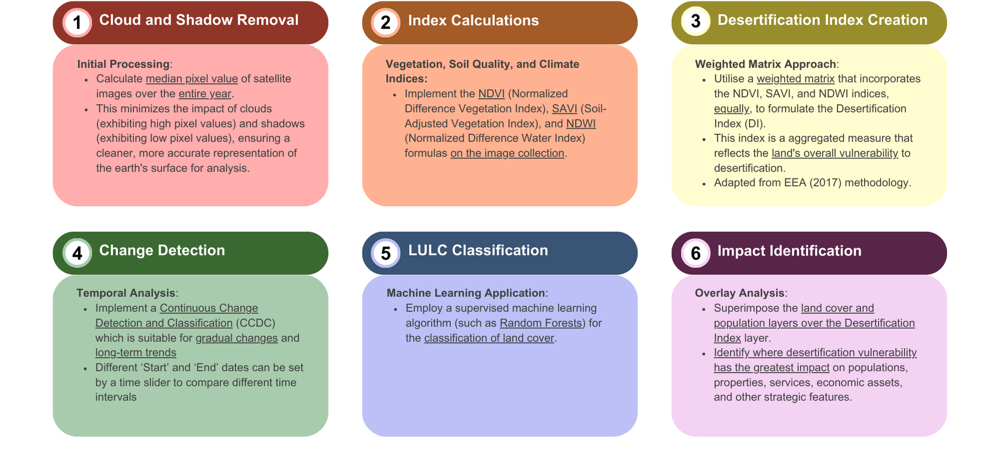

```{r echo = FALSE, message = FALSE, warning = FALSE}
library(here)
library(tidyverse)
library(knitr)
library(kableExtra)
library(readxl)
library(fs)
library(countdown)
library(xaringan)
library(xaringanExtra)
library(knitr)

hook_source <- knitr::knit_hooks$get('source')
knitr::knit_hooks$set(source = function(x, options) {
  x <- stringr::str_replace(x, "^[[:blank:]]?([^*].+?)[[:blank:]]*#<<[[:blank:]]*$", "*\\1")
  hook_source(x, options)
})

xaringanExtra::use_broadcast()
xaringanExtra::use_freezeframe()
xaringanExtra::use_scribble()
xaringanExtra::use_search(show_icon = TRUE, auto_search	=FALSE)
xaringanExtra::use_freezeframe()
xaringanExtra::use_clipboard()
xaringanExtra::use_tile_view()
xaringanExtra::use_panelset()
xaringanExtra::use_editable(expires = 1)
xaringanExtra::use_fit_screen()
xaringanExtra::use_extra_styles(
  hover_code_line = TRUE,         
  mute_unhighlighted_code = TRUE  
)

```

background-image: url('Images/112-ciencia-i-politica-.jpg') 
background-size: cover

class: inverse, center, middle, hide-logo

# Project Desert Rose
### Greening the Sahel in Southern Niger Against Desertification
```{r, echo=FALSE, out.width='10%'}
knitr::include_graphics('Images/RS - images/logo.jpeg')
```
#### CASA0023 Group Project  
#### 19/03/2024

---

class: center, middle, inverse

# WHY WE ARE HERE
### Context & Background

---
class: center, middle
# Niger is bearing the brunt of climate change
```{r xaringan-panelset, echo=FALSE}
xaringanExtra::use_panelset()
```

.panelset.sideways[
.panel[.panel-name[Hist. Temp Increase]

Surface Air Temperature has been **accelerating** at an alarming rate since the 1980s.

```{r, echo=FALSE, out.width='70%', fig.align='centre'}
knitr::include_graphics('Images/RS - images/Screenshot 2024-03-12 at 11.36.57.jpeg')
```

]

.panel[.panel-name[Proj. Temp Increase]
At this rate, projected number of hot days are exceeding records in the decades to come. From 2020, **40-degree days will be the norm**.
```{r, echo=FALSE, out.width='75%',fig.align='centre'}
knitr::include_graphics('Images/RS - images/output_djIgp0.gif')
```
]

.panel[.panel-name[Water Bodies Shrinkage]
Many important water bodies such as Lake Chad and the Niamey River have **seriously shrunken** in less than 3 decades due to sharp decrease in rainfall.

```{r, echo=FALSE, out.width='80%',fig.align='centre'}

```

```{r, echo=FALSE, out.width='80%',fig.align='centre'}

```
]

.panel[.panel-name[Natural Flora Loss]
Combined with unsustainable agricultural practices, we are seeing a **decline of natural steppes and savannas**

```{r, echo=FALSE, out.width='70%', fig.align='centre'}

```

]
]

---
# Nationwide initiatives are of high-priority

```{r, echo=FALSE, out.width='100%'}

```

---
# Vast potential with Great Green Wall...

The **"Great Green Wall"** (15km wide, 8000km long) seeks to increase arable land in the Sahel containing among eleven nations. Niger restoration potential is **25% of the total potential**. By 2030, the GGW initiative sets out to: 

- restore **100 million hectares** of currently degraded land, 
- reduce emissions, sequester **250 million tons of carbon**, and 
- create **10 million green jobs** in rural areas.

```{r, echo=FALSE, out.width='100%'}

```


---
# ...but hindered by systematic challenges
.pull-left[Despite some success, the progress of the GGW has been facing severe challenges in the last decade 

**Poor governance** at the heart of the issue:

- **Complex Stakeholders:** Funding comes mainly from multilateral and bilateral partnerships, NGOs, and technical/financial partners. Implementation also fragmented across local actors.
- **Data Challenges:** Existing data is scattered, unreliable, and not well-organized. It's generated and used by individual actors but not shared effectively.
- **Urgent Gap:** Maintaining and updating the unified data across diverse organisations via a centralised portal.
]

.pull-right[**Mapping of actors in Niger's GGW initiative**
```{r, echo=FALSE, out.width='85%'}

```
]

---
# We bring data and expertise to the rescue
*Our expertise in geospatial science with state-of-the-art remote sensing data brings transparency and mobilise coordinated action*
```{r, echo=FALSE, out.width='100%'}

```

---

class: center, middle, inverse

# HOW WE DO IT
### Our award-winning methodology

---
# Methodology Framework

```{r, echo=FALSE, out.width='100%'}

```

---
# A. Desertification Index and Risk Identification

```{r, echo=FALSE, out.width='100%'}

```

---
# B. Tree Planting Site Identification

```{r, echo=FALSE, out.width='100%'}

```

---
# Earth Observation Data

```{r echo=FALSE}
# Load the data from the Excel file
eo_data_df <- read_excel("images/data_eo.xlsx")

# Use kable and kableExtra to create a table with merged cells
kable_out <- kable(eo_data_df, "html", escape = FALSE, align = 'l') %>%
  kable_styling(bootstrap_options = c("striped", "hover", "condensed", "responsive")) %>%
  collapse_rows(columns = 1:6, valign = "middle")

# Print the table
kable_out
```

---
# Additional Data

```{r echo=FALSE}
# Load the data from the Excel file
eo_data_df <- read_excel("images/data_additional.xlsx")

# Use kable and kableExtra to create a table with merged cells
kable_out <- kable(eo_data_df, "html", escape = FALSE, align = 'l') %>%
  kable_styling(bootstrap_options = c("striped", "hover", "condensed", "responsive")) %>%
  collapse_rows(columns = 1:6, valign = "middle")

# Print the table
kable_out
```


---
# Sample Dashboard Preview
```{r echo=FALSE, out.width='100%', fig.align='center'}
knitr::include_graphics('Images/Dashboard Preview 2.png')
```
<div style="text-align: center; margin-top: 15px;">
    <p><em><strong>Source:</strong> eMapR Lab (2019)</em></p>
</div>

---
# Sample Dashboard Demo
```{r echo=FALSE, out.width='80%', fig.align='center'}
knitr::include_graphics('Images/Dashboard Dem.gif')
```
<div style="text-align: center; margin-top: 15px;">
    <p><em><strong>Source:</strong> eMapR Lab (2019)</em></p>
</div>

---
# Limitations and Proposed Mitigation
.panelset.sideways[
.panel[.panel-name[Insurgency]
.pull-left[Farmers are reported to fear carrying out reforestation or tree maintenance activities due to the jihadist threat, which could jeopardize the project.

**Mitigation:** Engage this data only in conjunction with local intel on insurgence activities before encouraging local task forces to commence crop and tree planting.]
.pull-right[
```{r echo=FALSE, out.width='100%', fig.align='center'}
knitr::include_graphics('Images/Nigerian-military-4.jpg')
```

<div style="text-align: center; margin-top: 15px;">
    <p><em><strong>Image Source:</strong> Reuters (2022)</em></p>
</div>
]
]
.panel[.panel-name[Land Conflict]
.pull-left[Need to introduce pastoral corridors to avoid the destruction of agriculture areas and Great Green Wall ecosystems, while ensuring access to food and water for the livestock of herder communities in the Sahel

**Mitigation:** Local liaison to confer with local herder and farmer communities to reconcile GGW planting areas. Maintain public engagement throughout implementation especially with communities living in the open steppes]
.pull-right[
```{r echo=FALSE, out.width='100%', fig.align='center'}

```

<div style="text-align: center; margin-top: 15px;">
    <p><em><strong>Image Source:</strong> Human Rights Watch (2014)</em></p>
</div>
]
]

.panel[.panel-name[Monoculture]
.pull-left[Focusing restoration effort using only few species may expose them to widespread disease setting back any progress made, while irreversibly affecting the entire ecosystem in the long run

**Mitigation:** Consult with expert botanists to diversify crop and tree species for the Great Green Wall planting effort.]
.pull-right[
```{r echo=FALSE, out.width='100%', fig.align='center'}
knitr::include_graphics('Images/monoculture.jpg')
```

<div style="text-align: center; margin-top: 15px;">
    <p><em><strong>Image Source:</strong> New York Times (2022)</em></p>
</div>
]
]

]

---

background-image: url('Images/greatgreenwall.jpg') 
background-size: cover
class: center, middle, inverse, hide-logo

# PLAN OF ACTION
### Putting it in motion

---
# Implementation Timeline

```{r, echo=FALSE, out.width='95%'}

```

---
# Projected Budget

```{r, echo=FALSE, out.width='80%',fig.align='centre'}
knitr::include_graphics('Images/compulsorycost.png')
```

.left-column[**Value-added Services**]
.right-column[
```{r, echo=FALSE, out.width='80%',fig.align='centre'}

```
]
---

background-image: url('Images/greatgreenwall.jpg') 
background-size: cover
class: center, middle, inverse, hide-logo

# THANK YOU
#### Aaron, Andrio, Huan, James, Maria, Sameera

---
# References


